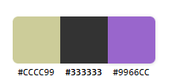

# 起始页开发计划
____

## 一. 功能  

功能部分这里分为两个部分, 主要功能 以及 其他功能  

主要功能:   
主要功能表示必须实现项, 该起始页必须要实现的功能  
- 通过切换图标来确定要跳转到哪个搜索引擎  
- 时间显示
- 回车搜索  

其他功能:  
其他功能用来说明起始页的附加功能有哪些, 这些功能需要进行商榷  
- 常用网站推荐
- 切换主题  
- 记事本  
- 自定义常用网站  
- 本地天气显示    
- 一言
- 背景采用每天换一张图片的方式
... (想你所想,能不能实现再去另说)  
  

  ## 二. 需求  

需求这里分为三个部分, 主要需求, 样式需求, 以及附加需求  

主要需求:  
主要需求用来描述一些关键性的需求; (可以理解为必须实现)  

- 响应式, 不同的浏览器窗口看到的是同一个页面,页面的大小随着页面的改变而改变
- 移动端适配, PC端 和 移动端 都能保证使用  
- 背景, 一款合适的背景可以让起始页看起来更加美观
- 时间, 刷新频率不能太高, 如果太高会浪费浏览器性能,

其他需求: 
- 背景(使用渐变 或者 单色 或者 图片 ) 背景方面可以采用毛玻璃的效果
- 颜色搭配, 要使用系列的颜色, 不能太多花哨, 也不能太过单一  
- 样式方面, 要么都用长方形, 要么都用圆角, 不能混搭  
- 要有一些动画的效果, 比如按钮点击, 鼠标指针划过, 
- logo的逼格高一点, 给弄个酷炫一些的(比如动画,或者经过专门的设计)

附加需求:  
附加需求是需要经过商议的部分  
- 一言的盒子需要添加毛玻璃效果
- 通过点击logo来实现功能的切换
- 天气方面添加图标
- 时间可以采用雪碧图的方式, 来设置卡通的时间显示

## 三. 实现方案 

- 移动端适配
  - 使用rem,媒体查询技术,实现移动端适配 
  - 编写两个个页面(一个式移动端,页面, 一个是电脑端页面,)
    -  判断初始进入网页时网页屏幕大小,来绝对是否重定向
    - 通过请求头中浏览器信息,来判断是否需要重定向(需要后端支持)
  
- 色彩搭配
  
  
  
    
  
- 天气
  - 通过高德地图提供的API去获取
  - 获取当前地区
    - 可以通过H5新增的功能来进行定位获取当前城市的坐标,进一步获取当前用户所在城市
    - 可以通过API获取当前地区
- 背景
  - 如果特效绚丽, 推荐使用简单色调的背景
    - 比如 黑色, 灰色,
  - 如果不做一些特效方面的事情, 可以使用图片壁纸的方式,
  
